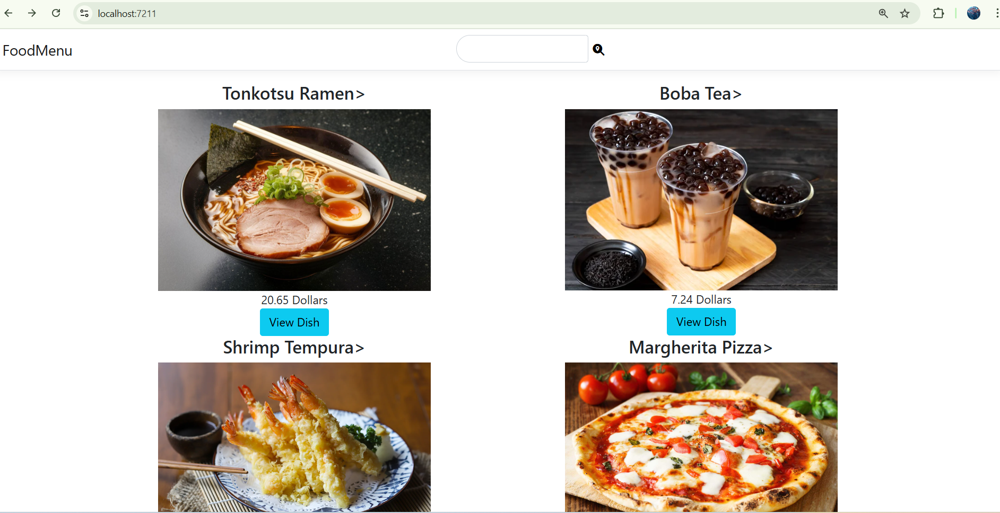
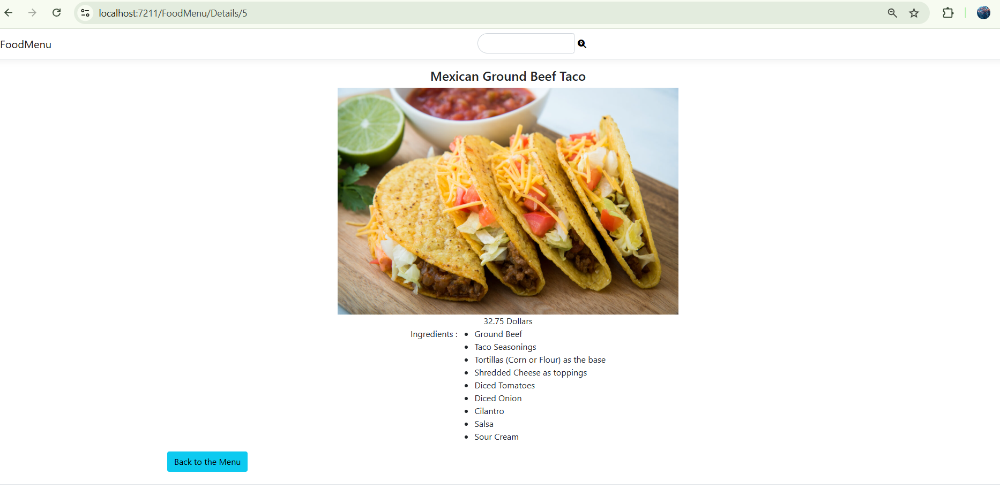

# Food Menu Web Application

This is a responsive food menu web application built using ASP.NET Core MVC and Entity Framework Core. It allows users to browse a variety of dishes, view detailed ingredients, and search for specific food items. The app uses a SQL Server database hosted locally via SQL Server Management Studio (SSMS).

---

## Features

- ASP.NET Core MVC architecture (Model-View-Controller)
- Displays dishes with name, image, and price
- “View Dish” button shows ingredients and details
- Integrated search bar to find dishes by name
- Many-to-many relationship between dishes and ingredients
- Database seeding using Entity Framework Core
- Responsive layout using Razor and Bootstrap

---

## Technologies Used

| Stack       | Tools/Technologies                  |
|-------------|-------------------------------------|
| **Frontend**| HTML, CSS, Bootstrap, Razor Views   |
| **Backend** | ASP.NET Core MVC, C#                |
| **Database**| SQL Server (via SSMS)               |
| **ORM**     | Entity Framework Core               |
| **IDE**     | Visual Studio 2022                  |
| **Version Control** | Git & GitHub               |

---

## Application Structure

### Models
- `Dish`: Represents a food item with name, price, and image
- `Ingredient`: Represents an ingredient used in a dish
- `DishIngredient`: Junction table to model the many-to-many relationship

### Data Context
- `MenuContext.cs`: Inherits from `DbContext` and configures entity relationships and seed data using Fluent API

### Controllers
- `FoodMenuController.cs`:
  - `Index`: Displays all dishes; includes search by dish name
  - `Details`: Shows dish details and its list of ingredients

### Views
- Strongly typed Razor views for listing dishes, showing details, and handling search input

---

## Screenshots

### 📌 Home Page
Displays a list of dishes with images and a search bar:



---

### 📌 Dish Details Page
Displays the selected dish with a detailed ingredient list:



---

## Database Configuration

The database is configured in `appsettings.json` or `Startup.cs` (depending on the version of ASP.NET Core). Here's a typical connection string:

```json
"ConnectionStrings": {
  "DefaultConnection": "Server=localhost\\SQLEXPRESS;Database=FoodMenuDB;Trusted_Connection=True;"
}
```

Run the following commands in the **Package Manager Console** to set up the database:

```bash
Add-Migration InitialCreate
Update-Database
```

---

## How to Run the Project

1. Clone the repository:
   ```bash
   git clone https://github.com/M-EdwardSamuel/FoodMenu.git
   ```

2. Open the solution in **Visual Studio 2022**

3. Ensure SQL Server is running locally (via SSMS)

4. Run the app using **IIS Express**

5. Navigate to `https://localhost:[port]/FoodMenu` in your browser

---

## Future Improvements

These are potential features that could be added in future iterations of the project:

- User login and admin dashboard for managing dishes
- Uploading custom images instead of fixed URLs
- Responsive design improvements for mobile users
- Filtering by dish categories or ingredients
- Deployment to a public hosting service like Azure

---

## License

This project is intended for academic and educational use. No commercial license is applied.
